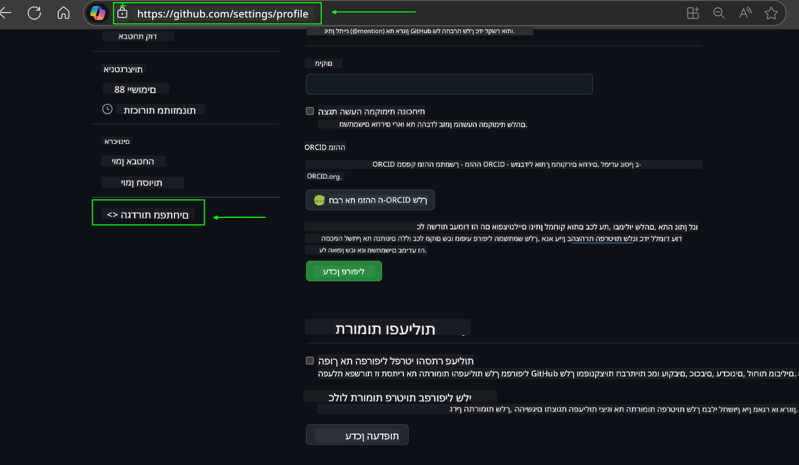
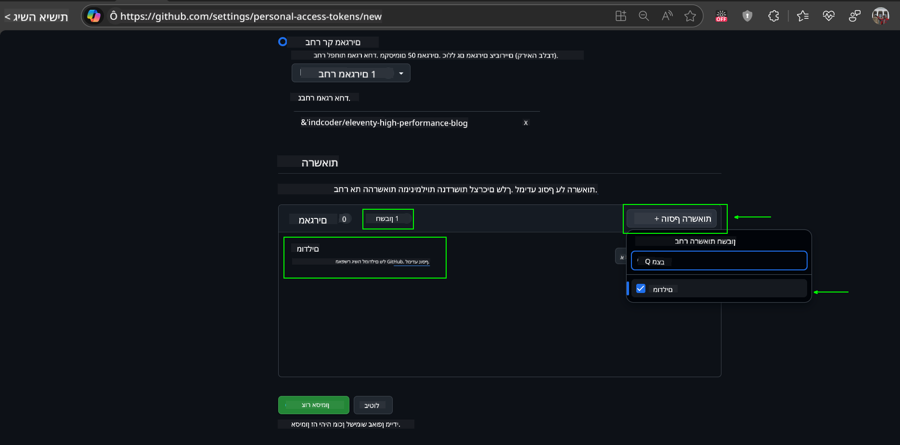
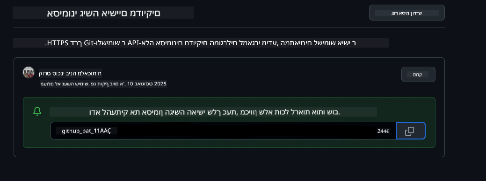

<!--
CO_OP_TRANSLATOR_METADATA:
{
  "original_hash": "c55b973b1562abf5aadf6a4028265ac5",
  "translation_date": "2025-08-29T17:38:23+00:00",
  "source_file": "00-course-setup/README.md",
  "language_code": "he"
}
-->
# הגדרת הקורס

## מבוא

השיעור הזה יעסוק כיצד להפעיל את דוגמאות הקוד של הקורס הזה.

## הצטרפו ללומדים אחרים וקבלו עזרה

לפני שאתם מתחילים לשכפל את המאגר שלכם, הצטרפו לערוץ [AI Agents For Beginners Discord](https://aka.ms/ai-agents/discord) כדי לקבל עזרה בהגדרה, לשאול שאלות על הקורס או להתחבר ללומדים אחרים.

## שכפול או יצירת Fork למאגר הזה

כדי להתחיל, אנא שכפלו או צרו Fork למאגר GitHub. זה ייצור גרסה משלכם של חומרי הקורס כך שתוכלו להפעיל, לבדוק ולשנות את הקוד!

ניתן לעשות זאת על ידי לחיצה על הקישור ל


## הפעלת הקוד

הקורס הזה מציע סדרת מחברות Jupyter שתוכלו להפעיל כדי לקבל ניסיון מעשי בבניית סוכני AI.

דוגמאות הקוד משתמשות באחת מהאפשרויות הבאות:

**דורש חשבון GitHub - חינם**:

1) Semantic Kernel Agent Framework + GitHub Models Marketplace. מסומן כ-(semantic-kernel.ipynb)
2) AutoGen Framework + GitHub Models Marketplace. מסומן כ-(autogen.ipynb)

**דורש מנוי Azure**:
3) Azure AI Foundry + Azure AI Agent Service. מסומן כ-(azureaiagent.ipynb)

אנו ממליצים לכם לנסות את כל שלושת סוגי הדוגמאות כדי לראות מה עובד הכי טוב עבורכם.

האפשרות שתבחרו תקבע אילו שלבי הגדרה תצטרכו לבצע בהמשך:

## דרישות

- Python 3.12+
  - **NOTE**: אם אין לכם Python3.12 מותקן, ודאו שאתם מתקינים אותו. לאחר מכן צרו את venv שלכם באמצעות python3.12 כדי להבטיח שהגרסאות הנכונות יותקנו מקובץ requirements.txt.
- חשבון GitHub - לגישה ל-GitHub Models Marketplace
- מנוי Azure - לגישה ל-Azure AI Foundry
- חשבון Azure AI Foundry - לגישה ל-Azure AI Agent Service

הכללנו קובץ `requirements.txt` בתיקיית השורש של המאגר הזה שמכיל את כל חבילות ה-Python הנדרשות להפעלת דוגמאות הקוד.

ניתן להתקין אותן על ידי הפעלת הפקודה הבאה בטרמינל בתיקיית השורש של המאגר:

```bash
pip install -r requirements.txt
```
אנו ממליצים ליצור סביבה וירטואלית של Python כדי להימנע מקונפליקטים ובעיות.

## הגדרת VSCode
ודאו שאתם משתמשים בגרסה הנכונה של Python ב-VSCode.


## הגדרה לדוגמאות באמצעות GitHub Models 

### שלב 1: השגת GitHub Personal Access Token (PAT)

הקורס הזה משתמש ב-GitHub Models Marketplace, המספק גישה חינמית למודלים של שפה גדולה (LLMs) שתשתמשו בהם לבניית סוכני AI.

כדי להשתמש ב-GitHub Models, תצטרכו ליצור [GitHub Personal Access Token](https://docs.github.com/en/authentication/keeping-your-account-and-data-secure/managing-your-personal-access-tokens).

ניתן לעשות זאת על ידי מעבר ל

בחשבון GitHub שלכם.

אנא עקבו אחר [Principle of Least Privilege](https://docs.github.com/en/get-started/learning-to-code/storing-your-secrets-safely) בעת יצירת הטוקן. המשמעות היא שעליכם לתת לטוקן רק את ההרשאות שהוא צריך כדי להפעיל את דוגמאות הקוד בקורס הזה.

1. בחרו באפשרות `Fine-grained tokens` בצד השמאלי של המסך על ידי מעבר ל-**Developer settings**
   

    לאחר מכן בחרו `Generate new token`.

    

2. הזינו שם תיאורי לטוקן שלכם שמשקף את מטרתו, כך שיהיה קל לזהות אותו מאוחר יותר.

    🔐 המלצה על משך הטוקן

    משך מומלץ: 30 ימים  
    עבור גישה מאובטחת יותר, תוכלו לבחור תקופה קצרה יותר—כמו 7 ימים 🛡️  
    זו דרך מצוינת להציב יעד אישי ולהשלים את הקורס בזמן שהמומנטום הלימודי שלכם גבוה 🚀.

    

3. הגבילו את טווח הטוקן ל-Fork של המאגר הזה.

    

4. הגבלות על הרשאות הטוקן: תחת **Permissions**, לחצו על לשונית **Account**, ולחצו על כפתור "+ Add permissions". תופיע תיבת בחירה. חפשו **Models** וסמנו את התיבה עבורו.
    

5. ודאו את ההרשאות הנדרשות לפני יצירת הטוקן. 

6. לפני יצירת הטוקן, ודאו שאתם מוכנים לשמור את הטוקן במקום מאובטח כמו כספת מנהל סיסמאות, מכיוון שהוא לא יוצג שוב לאחר יצירתו. 

העתיקו את הטוקן החדש שיצרתם זה עתה. כעת תוסיפו אותו לקובץ `.env` הכלול בקורס הזה.

### שלב 2: יצירת קובץ `.env`

כדי ליצור את קובץ `.env` שלכם, הפעילו את הפקודה הבאה בטרמינל.

```bash
cp .env.example .env
```

זה יעתיק את קובץ הדוגמה ויצור `.env` בתיקייה שלכם, שם תמלאו את הערכים עבור משתני הסביבה.

עם הטוקן שהועתק, פתחו את קובץ `.env` בעורך הטקסט המועדף עליכם והדביקו את הטוקן בשדה `GITHUB_TOKEN`.


כעת תוכלו להפעיל את דוגמאות הקוד של הקורס הזה.

## הגדרה לדוגמאות באמצעות Azure AI Foundry ו-Azure AI Agent Service

### שלב 1: השגת Azure Project Endpoint

עקבו אחר השלבים ליצירת hub ופרויקט ב-Azure AI Foundry שנמצאים כאן: [Hub resources overview](https://learn.microsoft.com/en-us/azure/ai-foundry/concepts/ai-resources)

לאחר שיצרתם את הפרויקט שלכם, תצטרכו להשיג את מחרוזת החיבור עבור הפרויקט שלכם.

ניתן לעשות זאת על ידי מעבר לדף **Overview** של הפרויקט שלכם בפורטל Azure AI Foundry.


### שלב 2: יצירת קובץ `.env`

כדי ליצור את קובץ `.env` שלכם, הפעילו את הפקודה הבאה בטרמינל.

```bash
cp .env.example .env
```

זה יעתיק את קובץ הדוגמה ויצור `.env` בתיקייה שלכם, שם תמלאו את הערכים עבור משתני הסביבה.

עם הטוקן שהועתק, פתחו את קובץ `.env` בעורך הטקסט המועדף עליכם והדביקו את הטוקן בשדה `PROJECT_ENDPOINT`.

### שלב 3: התחברות ל-Azure

כחלק מהמלצות אבטחה, נשתמש ב-[keyless authentication](https://learn.microsoft.com/azure/developer/ai/keyless-connections?tabs=csharp%2Cazure-cli?WT.mc_id=academic-105485-koreyst) כדי להתחבר ל-Azure OpenAI עם Microsoft Entra ID.

לאחר מכן, פתחו טרמינל והפעילו `az login --use-device-code` כדי להתחבר לחשבון Azure שלכם.

לאחר שהתחברתם, בחרו את המנוי שלכם בטרמינל.

## משתני סביבה נוספים - Azure Search ו-Azure OpenAI 

עבור שיעור Agentic RAG - שיעור 5 - יש דוגמאות שמשתמשות ב-Azure Search וב-Azure OpenAI.

אם תרצו להפעיל את הדוגמאות הללו, תצטרכו להוסיף את משתני הסביבה הבאים לקובץ `.env` שלכם:

### דף סקירה (פרויקט)

- `AZURE_SUBSCRIPTION_ID` - בדקו **Project details** בדף **Overview** של הפרויקט שלכם.

- `AZURE_AI_PROJECT_NAME` - הסתכלו בראש דף **Overview** של הפרויקט שלכם.

- `AZURE_OPENAI_SERVICE` - מצאו זאת בלשונית **Included capabilities** עבור **Azure OpenAI Service** בדף **Overview**.

### מרכז ניהול

- `AZURE_OPENAI_RESOURCE_GROUP` - עברו ל-**Project properties** בדף **Overview** של **Management Center**.

- `GLOBAL_LLM_SERVICE` - תחת **Connected resources**, מצאו את שם החיבור של **Azure AI Services**. אם לא מופיע, בדקו את **Azure portal** תחת קבוצת המשאבים שלכם עבור שם משאבי AI Services.

### דף מודלים + נקודות קצה

- `AZURE_OPENAI_EMBEDDING_DEPLOYMENT_NAME` - בחרו את מודל ההטמעה שלכם (לדוגמה, `text-embedding-ada-002`) ורשמו את **Deployment name** מפרטי המודל.

- `AZURE_OPENAI_CHAT_DEPLOYMENT_NAME` - בחרו את מודל הצ'אט שלכם (לדוגמה, `gpt-4o-mini`) ורשמו את **Deployment name** מפרטי המודל.

### פורטל Azure

- `AZURE_OPENAI_ENDPOINT` - חפשו **Azure AI services**, לחצו עליו, ואז עברו ל-**Resource Management**, **Keys and Endpoint**, גללו למטה ל-"Azure OpenAI endpoints", והעתיקו את זה שאומר "Language APIs".

- `AZURE_OPENAI_API_KEY` - מאותו מסך, העתיקו KEY 1 או KEY 2.

- `AZURE_SEARCH_SERVICE_ENDPOINT` - מצאו את משאב **Azure AI Search** שלכם, לחצו עליו, וראו **Overview**.

- `AZURE_SEARCH_API_KEY` - לאחר מכן עברו ל-**Settings** ואז ל-**Keys** כדי להעתיק את המפתח הראשי או המשני של מנהל המערכת.

### דף חיצוני

- `AZURE_OPENAI_API_VERSION` - בקרו בדף [API version lifecycle](https://learn.microsoft.com/en-us/azure/ai-services/openai/api-version-deprecation#latest-ga-api-release) תחת **Latest GA API release**.

### הגדרת keyless authentication

במקום להכניס את האישורים שלכם ישירות, נשתמש בחיבור ללא מפתח עם Azure OpenAI. לשם כך, נייבא את `DefaultAzureCredential` ונקרא לפונקציה `DefaultAzureCredential` כדי לקבל את האישורים.

```python
from azure.identity import DefaultAzureCredential, InteractiveBrowserCredential
```

## נתקעתם איפשהו?

אם יש לכם בעיות בהפעלת ההגדרה הזו, הצטרפו ל

או.

## השיעור הבא

כעת אתם מוכנים להפעיל את הקוד עבור הקורס הזה. למידה מהנה על עולם סוכני ה-AI!

[מבוא לסוכני AI ושימושים אפשריים](../01-intro-to-ai-agents/README.md)

---

**כתב ויתור**:  
מסמך זה תורגם באמצעות שירות תרגום מבוסס בינה מלאכותית [Co-op Translator](https://github.com/Azure/co-op-translator). למרות שאנו שואפים לדיוק, יש לקחת בחשבון שתרגומים אוטומטיים עשויים להכיל שגיאות או אי דיוקים. המסמך המקורי בשפתו המקורית צריך להיחשב כמקור סמכותי. עבור מידע קריטי, מומלץ להשתמש בתרגום מקצועי על ידי אדם. איננו נושאים באחריות לאי הבנות או לפרשנויות שגויות הנובעות משימוש בתרגום זה.