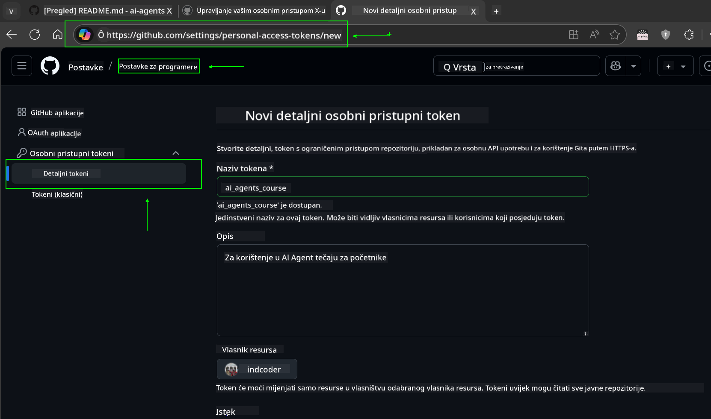
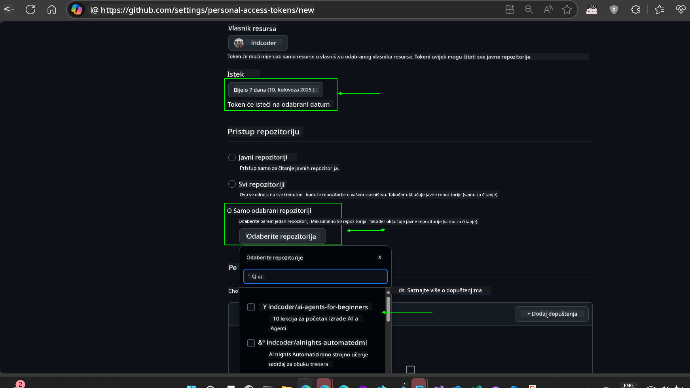
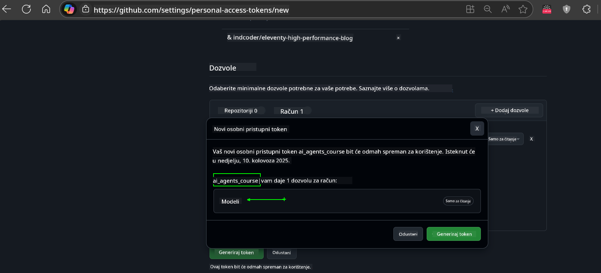
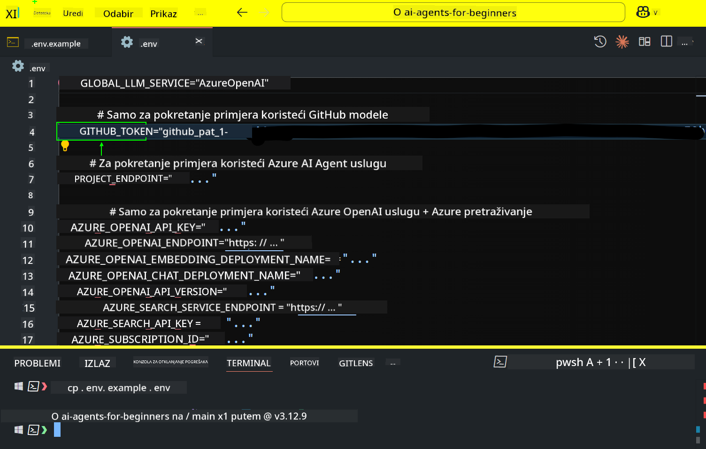

<!--
CO_OP_TRANSLATOR_METADATA:
{
  "original_hash": "c55b973b1562abf5aadf6a4028265ac5",
  "translation_date": "2025-08-29T23:02:55+00:00",
  "source_file": "00-course-setup/README.md",
  "language_code": "hr"
}
-->
# Postavljanje Tečaja

## Uvod

Ova lekcija će pokriti kako pokrenuti primjere koda ovog tečaja.

## Pridružite se drugim polaznicima i potražite pomoć

Prije nego što počnete klonirati svoj repozitorij, pridružite se [AI Agents For Beginners Discord kanalu](https://aka.ms/ai-agents/discord) kako biste dobili pomoć pri postavljanju, postavili pitanja o tečaju ili se povezali s drugim polaznicima.

## Klonirajte ili forkirajte ovaj repozitorij

Za početak, klonirajte ili forkirajte GitHub repozitorij. Time ćete dobiti vlastitu verziju materijala tečaja kako biste mogli pokretati, testirati i prilagođavati kod!

To možete učiniti klikom na poveznicu do

Trebali biste sada imati vlastitu forkiranu verziju ovog tečaja na sljedećoj poveznici:


## Pokretanje koda

Ovaj tečaj nudi niz Jupyter Notebooks datoteka koje možete pokrenuti kako biste stekli praktično iskustvo u izgradnji AI agenata.

Primjeri koda koriste:

**Zahtijeva GitHub račun - Besplatno**:

1) Semantic Kernel Agent Framework + GitHub Models Marketplace. Označeno kao (semantic-kernel.ipynb)  
2) AutoGen Framework + GitHub Models Marketplace. Označeno kao (autogen.ipynb)

**Zahtijeva Azure pretplatu**:  
3) Azure AI Foundry + Azure AI Agent Service. Označeno kao (azureaiagent.ipynb)

Preporučujemo da isprobate sve tri vrste primjera kako biste vidjeli koji vam najbolje odgovara.

Ovisno o opciji koju odaberete, slijedite odgovarajuće korake za postavljanje u nastavku:

## Zahtjevi

- Python 3.12+  
  - **NAPOMENA**: Ako nemate instaliran Python 3.12, osigurajte da ga instalirate. Zatim kreirajte svoj virtualni okoliš koristeći python3.12 kako biste osigurali da se instaliraju ispravne verzije iz datoteke requirements.txt.
- GitHub račun - Za pristup GitHub Models Marketplaceu
- Azure pretplata - Za pristup Azure AI Foundryju
- Azure AI Foundry račun - Za pristup Azure AI Agent Serviceu

U korijenu ovog repozitorija uključili smo datoteku `requirements.txt` koja sadrži sve potrebne Python pakete za pokretanje primjera koda.

Možete ih instalirati pokretanjem sljedeće naredbe u terminalu na korijenu repozitorija:

```bash
pip install -r requirements.txt
```

Preporučujemo kreiranje Python virtualnog okoliša kako biste izbjegli konflikte i probleme.

## Postavljanje VSCode-a

Provjerite koristite li ispravnu verziju Pythona u VSCode-u.


## Postavljanje za primjere koji koriste GitHub modele

### Korak 1: Dohvatite svoj GitHub Personal Access Token (PAT)

Ovaj tečaj koristi GitHub Models Marketplace, koji omogućuje besplatan pristup velikim jezičnim modelima (LLM-ovima) koje ćete koristiti za izgradnju AI agenata.

Za korištenje GitHub modela, trebate kreirati [GitHub Personal Access Token](https://docs.github.com/en/authentication/keeping-your-account-and-data-secure/managing-your-personal-access-tokens).

To možete učiniti odlaskom na svoj

GitHub račun.

Slijedite [načelo najmanjih privilegija](https://docs.github.com/en/get-started/learning-to-code/storing-your-secrets-safely) prilikom kreiranja tokena. To znači da tokenu trebate dodijeliti samo one dozvole koje su potrebne za pokretanje primjera koda u ovom tečaju.

1. Odaberite opciju `Fine-grained tokens` na lijevoj strani ekrana tako da odete na **Developer settings**  
   

   Zatim odaberite `Generate new token`.

   

2. Unesite opisni naziv za svoj token koji odražava njegovu svrhu, kako biste ga kasnije lako prepoznali.

    🔐 Preporuka za trajanje tokena

    Preporučeno trajanje: 30 dana  
    Za sigurniji pristup možete odabrati kraće razdoblje—na primjer, 7 dana 🛡️  
    To je odličan način da postavite osobni cilj i završite tečaj dok je vaš entuzijazam za učenje na vrhuncu 🚀.

    

3. Ograničite opseg tokena na svoj fork ovog repozitorija.

    

4. Ograničite dozvole tokena: Pod **Permissions**, kliknite karticu **Account**, a zatim gumb "+ Add permissions". Pojavit će se padajući izbornik. Potražite **Models** i označite okvir za to.  
    

5. Provjerite potrebne dozvole prije generiranja tokena. 

6. Prije nego što generirate token, osigurajte da ste spremni pohraniti token na sigurno mjesto, poput trezora za lozinke, jer se neće ponovno prikazati nakon što ga kreirate. 

Kopirajte svoj novi token koji ste upravo kreirali. Sada ćete ga dodati u svoju `.env` datoteku uključenu u ovaj tečaj.

### Korak 2: Kreirajte svoju `.env` datoteku

Za kreiranje `.env` datoteke pokrenite sljedeću naredbu u svom terminalu.

```bash
cp .env.example .env
```

Ovo će kopirati primjer datoteke i kreirati `.env` u vašem direktoriju, gdje ćete popuniti vrijednosti za varijable okruženja.

S kopiranim tokenom, otvorite `.env` datoteku u svom omiljenom uređivaču teksta i zalijepite svoj token u polje `GITHUB_TOKEN`.  


Sada biste trebali biti u mogućnosti pokrenuti primjere koda ovog tečaja.

## Postavljanje za primjere koji koriste Azure AI Foundry i Azure AI Agent Service

### Korak 1: Dohvatite krajnju točku svog Azure projekta

Slijedite korake za kreiranje huba i projekta u Azure AI Foundryju opisane ovdje: [Pregled resursa huba](https://learn.microsoft.com/en-us/azure/ai-foundry/concepts/ai-resources)

Nakon što ste kreirali svoj projekt, trebate dohvatiti niz za povezivanje svog projekta.

To možete učiniti odlaskom na stranicu **Overview** svog projekta u Azure AI Foundry portalu.


### Korak 2: Kreirajte svoju `.env` datoteku

Za kreiranje `.env` datoteke pokrenite sljedeću naredbu u svom terminalu.

```bash
cp .env.example .env
```

Ovo će kopirati primjer datoteke i kreirati `.env` u vašem direktoriju, gdje ćete popuniti vrijednosti za varijable okruženja.

S kopiranim tokenom, otvorite `.env` datoteku u svom omiljenom uređivaču teksta i zalijepite svoj token u polje `PROJECT_ENDPOINT`.

### Korak 3: Prijavite se na Azure

Kao sigurnosnu najbolju praksu, koristit ćemo [autentifikaciju bez ključa](https://learn.microsoft.com/azure/developer/ai/keyless-connections?tabs=csharp%2Cazure-cli?WT.mc_id=academic-105485-koreyst) za autentifikaciju na Azure OpenAI pomoću Microsoft Entra ID-a.

Zatim otvorite terminal i pokrenite `az login --use-device-code` kako biste se prijavili na svoj Azure račun.

Nakon što ste se prijavili, odaberite svoju pretplatu u terminalu.

## Dodatne varijable okruženja - Azure Search i Azure OpenAI

Za lekciju Agentic RAG - Lekcija 5 - postoje primjeri koji koriste Azure Search i Azure OpenAI.

Ako želite pokrenuti te primjere, trebate dodati sljedeće varijable okruženja u svoju `.env` datoteku:

### Stranica Pregled (Projekt)

- `AZURE_SUBSCRIPTION_ID` - Provjerite **Project details** na stranici **Overview** svog projekta.

- `AZURE_AI_PROJECT_NAME` - Pogledajte vrh stranice **Overview** svog projekta.

- `AZURE_OPENAI_SERVICE` - Pronađite ovo na kartici **Included capabilities** za **Azure OpenAI Service** na stranici **Overview**.

### Centar za upravljanje

- `AZURE_OPENAI_RESOURCE_GROUP` - Idite na **Project properties** na stranici **Overview** u **Management Center**.

- `GLOBAL_LLM_SERVICE` - Pod **Connected resources**, pronađite naziv veze za **Azure AI Services**. Ako nije navedeno, provjerite **Azure portal** pod svojom grupom resursa za naziv resursa AI usluga.

### Stranica Modeli + Krajnje točke

- `AZURE_OPENAI_EMBEDDING_DEPLOYMENT_NAME` - Odaberite svoj embedding model (npr. `text-embedding-ada-002`) i zabilježite **Deployment name** iz detalja modela.

- `AZURE_OPENAI_CHAT_DEPLOYMENT_NAME` - Odaberite svoj chat model (npr. `gpt-4o-mini`) i zabilježite **Deployment name** iz detalja modela.

### Azure Portal

- `AZURE_OPENAI_ENDPOINT` - Potražite **Azure AI services**, kliknite na to, zatim idite na **Resource Management**, **Keys and Endpoint**, skrolajte dolje do "Azure OpenAI endpoints" i kopirajte onaj koji kaže "Language APIs".

- `AZURE_OPENAI_API_KEY` - S iste stranice, kopirajte KLJUČ 1 ili KLJUČ 2.

- `AZURE_SEARCH_SERVICE_ENDPOINT` - Pronađite svoj **Azure AI Search** resurs, kliknite na njega i pogledajte **Overview**.

- `AZURE_SEARCH_API_KEY` - Zatim idite na **Settings** i zatim **Keys** kako biste kopirali primarni ili sekundarni administratorski ključ.

### Vanjska stranica

- `AZURE_OPENAI_API_VERSION` - Posjetite stranicu [API verzije](https://learn.microsoft.com/en-us/azure/ai-services/openai/api-version-deprecation#latest-ga-api-release) pod **Latest GA API release**.

### Postavljanje autentifikacije bez ključa

Umjesto da hardkodiramo vaše vjerodajnice, koristit ćemo vezu bez ključa s Azure OpenAI. Da bismo to učinili, uvest ćemo `DefaultAzureCredential` i kasnije pozvati funkciju `DefaultAzureCredential` za dobivanje vjerodajnice.

```python
from azure.identity import DefaultAzureCredential, InteractiveBrowserCredential
```

## Zapeli ste negdje?

Ako imate bilo kakvih problema s pokretanjem ovog postavljanja, pridružite se našem

ili.

## Sljedeća lekcija

Sada ste spremni pokrenuti kod za ovaj tečaj. Sretno u učenju više o svijetu AI agenata!

[Uvod u AI agente i primjere upotrebe agenata](../01-intro-to-ai-agents/README.md)

---

**Odricanje od odgovornosti**:  
Ovaj dokument je preveden pomoću AI usluge za prevođenje [Co-op Translator](https://github.com/Azure/co-op-translator). Iako nastojimo osigurati točnost, imajte na umu da automatski prijevodi mogu sadržavati pogreške ili netočnosti. Izvorni dokument na izvornom jeziku treba smatrati autoritativnim izvorom. Za kritične informacije preporučuje se profesionalni prijevod od strane čovjeka. Ne preuzimamo odgovornost za bilo kakva pogrešna shvaćanja ili tumačenja koja proizlaze iz korištenja ovog prijevoda.