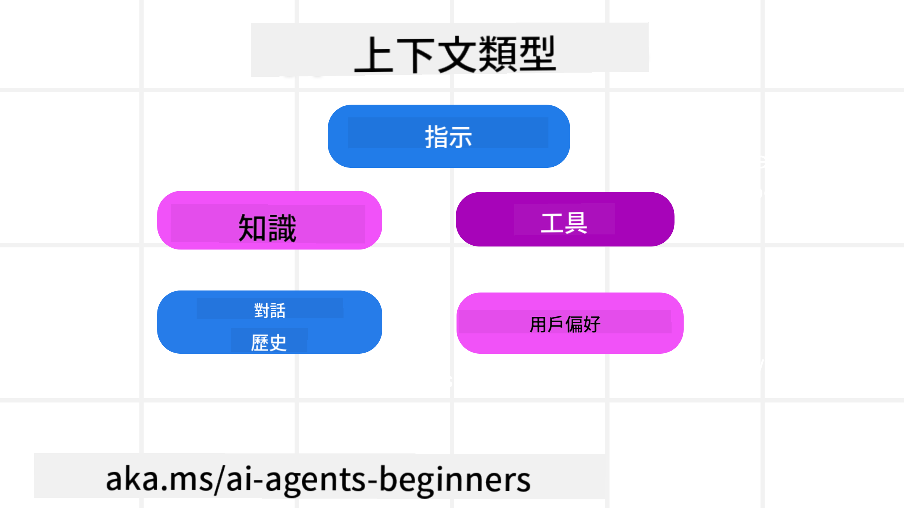
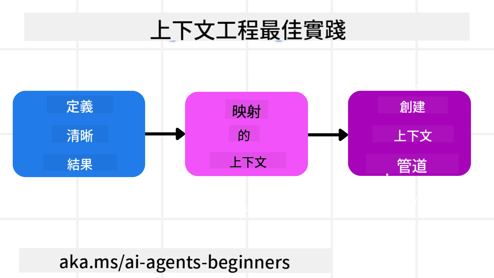

<!--
CO_OP_TRANSLATOR_METADATA:
{
  "original_hash": "cb7e50f471905ce6fdb92a30269a7a98",
  "translation_date": "2025-09-04T09:49:25+00:00",
  "source_file": "12-context-engineering/README.md",
  "language_code": "mo"
}
-->
# AI代理的情境工程

> _(點擊上方圖片觀看本課程影片)_

了解您正在為其構建AI代理的應用程式的複雜性，對於打造可靠的代理至關重要。我們需要構建能有效管理資訊的AI代理，以應對超越提示工程的複雜需求。

在本課程中，我們將探討什麼是情境工程以及它在構建AI代理中的角色。

## 課程介紹

本課程將涵蓋：

• **什麼是情境工程**，以及它與提示工程的不同之處。

• **有效情境工程的策略**，包括如何撰寫、選擇、壓縮和隔離資訊。

• **常見的情境失敗**可能使您的AI代理偏離軌道，以及如何修復它們。

## 學習目標

完成本課程後，您將能夠：

• **定義情境工程**並區分它與提示工程的差異。

• **識別大型語言模型（LLM）應用中的情境關鍵組成部分**。

• **應用撰寫、選擇、壓縮和隔離情境的策略**以提升代理性能。

• **識別常見的情境失敗**，如污染、分心、混淆和衝突，並實施緩解技術。

## 什麼是情境工程？

對於AI代理而言，情境是驅動代理規劃採取某些行動的核心。情境工程是確保AI代理擁有完成任務下一步所需正確資訊的實踐。情境窗口的大小有限，因此作為代理構建者，我們需要建立系統和流程來管理資訊的添加、移除和壓縮。

### 提示工程 vs 情境工程

提示工程專注於一組靜態指令，以有效地用規則引導AI代理。情境工程則是如何管理一組動態資訊，包括初始提示，以確保AI代理隨時間擁有所需的資訊。情境工程的核心理念是使這一過程可重複且可靠。

### 情境的類型

重要的是要記住，情境不僅僅是一件事。AI代理需要的資訊可能來自多種不同來源，我們需要確保代理能夠訪問這些來源：

AI代理可能需要管理的情境類型包括：

• **指令：** 這些就像代理的“規則”——提示、系統消息、少量示例（展示AI如何完成某事）以及它可以使用的工具描述。這是提示工程與情境工程結合的地方。

• **知識：** 包括事實、從資料庫檢索的資訊或代理累積的長期記憶。這包括整合檢索增強生成（RAG）系統，以便代理需要訪問不同的知識庫和資料庫。

• **工具：** 包括代理可以調用的外部函數、API和MCP伺服器的定義，以及使用它們後獲得的反饋（結果）。

• **對話歷史：** 與使用者的持續對話。隨著時間的推移，這些對話變得越來越長和複雜，這意味著它們佔據了情境窗口的空間。

• **使用者偏好：** 隨時間學習到的使用者喜好或不喜好。這些可以在做出關鍵決策以幫助使用者時被調用。

## 有效情境工程的策略

### 規劃策略

良好的情境工程始於良好的規劃。以下是幫助您開始思考如何應用情境工程概念的方法：

1. **定義清晰的結果** - AI代理將被分配的任務結果應明確定義。回答問題——“當AI代理完成任務時，世界會是什麼樣子？”換句話說，使用者在與AI代理互動後應該獲得什麼樣的改變、資訊或回應。

2. **繪製情境地圖** - 一旦您定義了AI代理的結果，您需要回答“AI代理需要什麼資訊才能完成這項任務？”這樣您就可以開始繪製資訊所在的情境地圖。

3. **建立情境管道** - 現在您知道資訊的位置，您需要回答“代理如何獲得這些資訊？”這可以通過多種方式完成，包括RAG、使用MCP伺服器和其他工具。

### 實用策略

規劃很重要，但一旦資訊開始流入代理的情境窗口，我們需要有實用的策略來管理它：

#### 管理情境

雖然某些資訊會自動添加到情境窗口中，情境工程則是更積極地管理這些資訊，可以通過以下幾種策略完成：

1. **代理便箋**  
   這允許AI代理在單次會話期間記錄當前任務和使用者互動的相關資訊。這應存在於情境窗口之外，例如文件或運行時物件，代理可以在需要時稍後檢索。

2. **記憶**  
   便箋適合管理單次會話情境窗口之外的資訊。記憶使代理能夠在多次會話中存儲和檢索相關資訊，包括摘要、使用者偏好和未來改進的反饋。

3. **壓縮情境**  
   當情境窗口增長並接近其限制時，可以使用摘要和修剪等技術。這包括僅保留最相關的資訊或移除較舊的消息。

4. **多代理系統**  
   開發多代理系統是一種情境工程形式，因為每個代理都有自己的情境窗口。如何共享和傳遞這些情境是構建這些系統時需要規劃的另一個方面。

5. **沙盒環境**  
   如果代理需要運行一些代碼或處理文檔中的大量資訊，這可能需要大量的令牌來處理結果。代理可以使用沙盒環境運行代碼，僅讀取結果和其他相關資訊，而不是將所有內容存儲在情境窗口中。

6. **運行時狀態物件**  
   通過創建資訊容器來管理代理需要訪問特定資訊的情況。對於複雜任務，這使代理能夠逐步存儲每個子任務的結果，讓情境僅與特定子任務保持連接。

### 情境工程示例

假設我們希望AI代理**“幫我預訂去巴黎的旅行。”**

• 僅使用提示工程的簡單代理可能只會回應：**“好的，您想什麼時候去巴黎？”** 它僅處理使用者當時提出的直接問題。

• 使用情境工程策略的代理則會做得更多。在回應之前，它的系統可能：

  ◦ **檢查您的日曆**以查看可用日期（檢索實時數據）。

 ◦ **回憶過去的旅行偏好**（來自長期記憶），例如您偏好的航空公司、預算或是否喜歡直飛。

 ◦ **識別可用工具**用於航班和酒店預訂。

- 然後，示例回應可能是：**“嗨，[您的名字]！我看到您在十月的第一周有空。要不要我幫您找[偏好航空公司]的直飛航班，並保持在您的預算[預算]範圍內？”** 這種更豐富的情境感知回應展示了情境工程的威力。

## 常見的情境失敗

### 情境污染

**問題描述：** 當LLM生成的幻覺（虛假資訊）或錯誤進入情境並被反覆引用，導致代理追求不可能的目標或制定荒謬的策略。

**解決方法：** 實施**情境驗證**和**隔離**。在將資訊添加到長期記憶之前進行驗證。如果檢測到潛在污染，啟動新的情境線程以防止錯誤資訊擴散。

**旅行預訂示例：** 您的代理幻覺出現了一個**從小型地方機場到遠程國際城市的直飛航班**，但該機場實際上不提供國際航班。這個不存在的航班細節被保存到情境中。稍後，當您要求代理預訂時，它不斷嘗試為這條不可能的路線尋找票，導致反覆錯誤。

**解決方案：** 在將航班細節添加到代理的工作情境之前，實施一個步驟**通過實時API驗證航班存在和路線**。如果驗證失敗，錯誤資訊將被“隔離”，不再使用。

### 情境分心

**問題描述：** 當情境變得過於龐大，模型過度關注累積的歷史，而不是使用訓練期間學到的內容，導致重複或無效的行動。即使在情境窗口未滿之前，模型也可能開始犯錯。

**解決方法：** 使用**情境摘要**。定期將累積資訊壓縮成更短的摘要，保留重要細節，同時移除冗餘歷史。這有助於“重置”焦點。

**旅行預訂示例：** 您長時間討論了各種夢想旅行目的地，包括詳細回憶了兩年前的背包旅行。當您最終要求**“幫我找下個月的便宜航班”**時，代理陷入了舊的、不相關的細節中，並不斷詢問您的背包裝備或過去的行程，而忽略了您當前的請求。

**解決方案：** 在一定次數的回合後或當情境過於龐大時，代理應**摘要最近且相關的對話部分**——專注於您當前的旅行日期和目的地——並使用該壓縮摘要進行下一次LLM調用，丟棄不相關的歷史聊天。

### 情境混淆

**問題描述：** 當不必要的情境（通常是過多的可用工具）導致模型生成錯誤回應或調用不相關的工具。較小的模型尤其容易出現此問題。

**解決方法：** 使用RAG技術實施**工具負載管理**。將工具描述存儲在向量資料庫中，並為每個特定任務選擇_僅_最相關的工具。研究表明，將工具選擇限制在少於30個。

**旅行預訂示例：** 您的代理可以訪問數十種工具：`book_flight`、`book_hotel`、`rent_car`、`find_tours`、`currency_converter`、`weather_forecast`、`restaurant_reservations`等。您詢問，**“在巴黎最好的交通方式是什麼？”** 由於工具數量過多，代理感到困惑，試圖在巴黎內部調用`book_flight`，或調用`rent_car`，即使您更喜歡公共交通，因為工具描述可能重疊或代理無法分辨最佳選擇。

**解決方案：** 使用**RAG工具描述**。當您詢問巴黎的交通方式時，系統根據您的查詢動態檢索_僅_最相關的工具，例如`rent_car`或`public_transport_info`，向LLM呈現一個專注的“工具負載”。

### 情境衝突

**問題描述：** 當情境中存在衝突資訊時，導致不一致的推理或錯誤的最終回應。這通常發生在資訊分階段到達時，早期的錯誤假設仍然保留在情境中。

**解決方法：** 使用**情境修剪**和**卸載**。修剪意味著隨著新細節到達，移除過時或衝突的資訊。卸載則為模型提供一個單獨的“便箋”工作區，以處理資訊而不使主要情境混亂。

**旅行預訂示例：** 您最初告訴代理，**“我想坐經濟艙。”** 後來在對話中，您改變主意並說，**“其實這次旅行，我想坐商務艙。”** 如果兩個指令都保留在情境中，代理可能會收到衝突的搜索結果或對優先事項感到困惑。

**解決方案：** 實施**情境修剪**。當新指令與舊指令矛盾時，舊指令被移除或明確覆蓋在情境中。或者，代理可以使用**便箋**在決定之前調和衝突的偏好，確保只有最終一致的指令指導其行動。

## 對情境工程有更多疑問？

加入[Azure AI Foundry Discord](https://aka.ms/ai-agents/discord)，與其他學習者交流，參加辦公時間並解答您的AI代理相關問題。

---

**免責聲明**：  
本文件已使用 AI 翻譯服務 [Co-op Translator](https://github.com/Azure/co-op-translator) 進行翻譯。儘管我們努力確保翻譯的準確性，但請注意，自動翻譯可能包含錯誤或不準確之處。原始文件的母語版本應被視為權威來源。對於關鍵信息，建議尋求專業人工翻譯。我們對因使用此翻譯而引起的任何誤解或錯誤解釋不承擔責任。