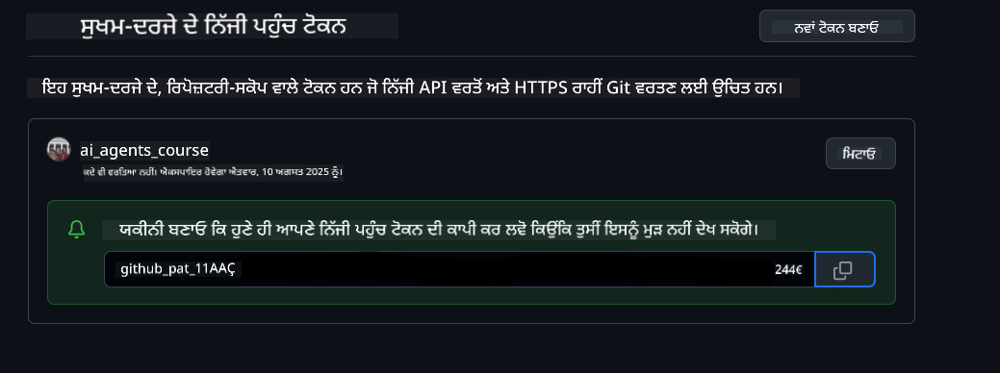
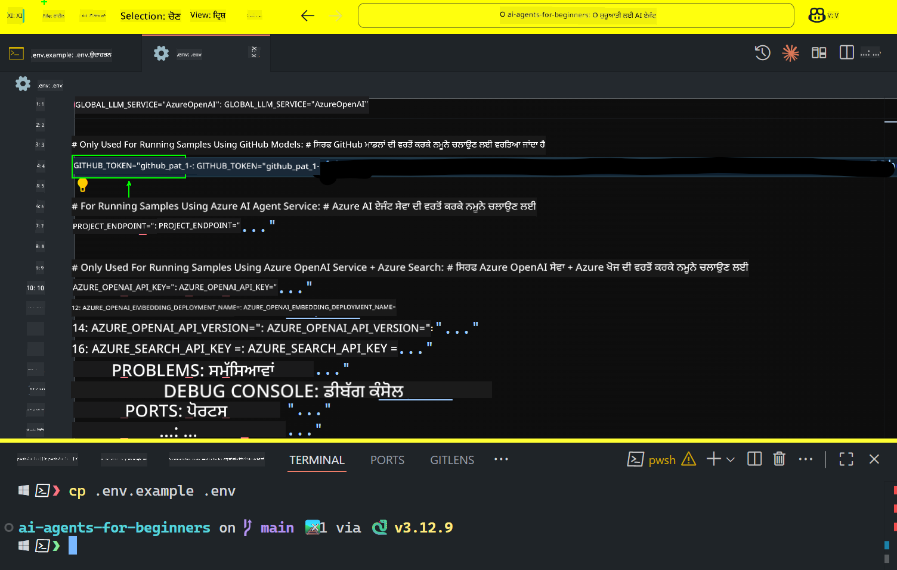

<!--
CO_OP_TRANSLATOR_METADATA:
{
  "original_hash": "c55b973b1562abf5aadf6a4028265ac5",
  "translation_date": "2025-08-29T10:35:57+00:00",
  "source_file": "00-course-setup/README.md",
  "language_code": "pa"
}
-->
# ਕੋਰਸ ਸੈਟਅੱਪ

## ਪਰਿਚਯ

ਇਸ ਪਾਠ ਵਿੱਚ ਤੁਸੀਂ ਸਿੱਖੋਗੇ ਕਿ ਇਸ ਕੋਰਸ ਦੇ ਕੋਡ ਨਮੂਨਿਆਂ ਨੂੰ ਕਿਵੇਂ ਚਲਾਉਣਾ ਹੈ।

## ਹੋਰ ਸਿੱਖਣ ਵਾਲਿਆਂ ਨਾਲ ਜੁੜੋ ਅਤੇ ਮਦਦ ਪ੍ਰਾਪਤ ਕਰੋ

ਆਪਣਾ ਰਿਪੋ ਕਲੋਨ ਕਰਨ ਤੋਂ ਪਹਿਲਾਂ, [AI Agents For Beginners Discord channel](https://aka.ms/ai-agents/discord) ਵਿੱਚ ਸ਼ਾਮਲ ਹੋਵੋ ਤਾਂ ਜੋ ਸੈਟਅੱਪ ਵਿੱਚ ਮਦਦ ਲਈ, ਕੋਰਸ ਬਾਰੇ ਕੋਈ ਵੀ ਸਵਾਲ ਪੁੱਛਣ ਲਈ, ਜਾਂ ਹੋਰ ਸਿੱਖਣ ਵਾਲਿਆਂ ਨਾਲ ਜੁੜਨ ਲਈ।

## ਇਸ ਰਿਪੋ ਨੂੰ ਕਲੋਨ ਜਾਂ ਫੋਰਕ ਕਰੋ

ਸ਼ੁਰੂ ਕਰਨ ਲਈ, ਕਿਰਪਾ ਕਰਕੇ GitHub ਰਿਪੋਜ਼ਟਰੀ ਨੂੰ ਕਲੋਨ ਜਾਂ ਫੋਰਕ ਕਰੋ। ਇਸ ਨਾਲ ਤੁਹਾਡੇ ਕੋਲ ਕੋਰਸ ਮਟੀਰੀਅਲ ਦਾ ਆਪਣਾ ਵਰਜਨ ਹੋਵੇਗਾ, ਜਿਸ ਨਾਲ ਤੁਸੀਂ ਕੋਡ ਨੂੰ ਚਲਾ ਸਕੋਗੇ, ਟੈਸਟ ਕਰ ਸਕੋਗੇ ਅਤੇ ਇਸ ਵਿੱਚ ਸੋਧ ਕਰ ਸਕੋਗੇ!

ਇਹ ਕੰਮ ਲਿੰਕ 'ਤੇ ਕਲਿੱਕ ਕਰਕੇ ਕੀਤਾ ਜਾ ਸਕਦਾ ਹੈ:


## ਕੋਡ ਚਲਾਉਣਾ

ਇਹ ਕੋਰਸ Jupyter Notebooks ਦੀ ਇੱਕ ਲੜੀ ਪੇਸ਼ ਕਰਦਾ ਹੈ, ਜੋ ਤੁਹਾਨੂੰ AI Agents ਬਣਾਉਣ ਦਾ ਹੱਥ-ਅਨੁਭਵ ਪ੍ਰਦਾਨ ਕਰਦਾ ਹੈ।

ਕੋਡ ਨਮੂਨੇ ਹੇਠਾਂ ਦਿੱਤੇ ਵਿੱਚੋਂ ਕਿਸੇ ਇੱਕ ਨੂੰ ਵਰਤਦੇ ਹਨ:

**GitHub ਖਾਤਾ ਲੋੜੀਂਦਾ ਹੈ - ਮੁਫ਼ਤ**:

1) Semantic Kernel Agent Framework + GitHub Models Marketplace. (semantic-kernel.ipynb) ਦੇ ਤੌਰ 'ਤੇ ਲੇਬਲ ਕੀਤਾ ਗਿਆ।
2) AutoGen Framework + GitHub Models Marketplace. (autogen.ipynb) ਦੇ ਤੌਰ 'ਤੇ ਲੇਬਲ ਕੀਤਾ ਗਿਆ।

**Azure ਸਬਸਕ੍ਰਿਪਸ਼ਨ ਲੋੜੀਂਦੀ ਹੈ**:
3) Azure AI Foundry + Azure AI Agent Service. (azureaiagent.ipynb) ਦੇ ਤੌਰ 'ਤੇ ਲੇਬਲ ਕੀਤਾ ਗਿਆ।

ਅਸੀਂ ਤੁਹਾਨੂੰ ਤਿੰਨਾਂ ਕਿਸਮਾਂ ਦੇ ਉਦਾਹਰਣਾਂ ਨੂੰ ਅਜ਼ਮਾਉਣ ਦੀ ਸਿਫਾਰਸ਼ ਕਰਦੇ ਹਾਂ ਤਾਂ ਜੋ ਤੁਸੀਂ ਵੇਖ ਸਕੋ ਕਿ ਤੁਹਾਡੇ ਲਈ ਕਿਹੜਾ ਵਧੀਆ ਕੰਮ ਕਰਦਾ ਹੈ।

ਤੁਸੀਂ ਜੋ ਵੀ ਵਿਕਲਪ ਚੁਣਦੇ ਹੋ, ਇਹ ਨਿਰਧਾਰਤ ਕਰੇਗਾ ਕਿ ਹੇਠਾਂ ਦਿੱਤੇ ਸੈਟਅੱਪ ਦੇ ਕਿਹੜੇ ਕਦਮਾਂ ਦੀ ਤੁਹਾਨੂੰ ਪਾਲਣਾ ਕਰਨ ਦੀ ਲੋੜ ਹੈ:

## ਲੋੜਾਂ

- Python 3.12+
  - **NOTE**: ਜੇ ਤੁਹਾਡੇ ਕੋਲ Python3.12 ਇੰਸਟਾਲ ਨਹੀਂ ਹੈ, ਤਾਂ ਇਹ ਯਕੀਨੀ ਬਣਾਓ ਕਿ ਤੁਸੀਂ ਇਸਨੂੰ ਇੰਸਟਾਲ ਕਰੋ। ਫਿਰ python3.12 ਦੀ ਵਰਤੋਂ ਕਰਕੇ ਆਪਣਾ venv ਬਣਾਓ ਤਾਂ ਜੋ requirements.txt ਫਾਈਲ ਤੋਂ ਸਹੀ ਵਰਜਨ ਇੰਸਟਾਲ ਹੋ ਸਕਣ।
- GitHub ਖਾਤਾ - GitHub Models Marketplace ਤੱਕ ਪਹੁੰਚ ਲਈ
- Azure ਸਬਸਕ੍ਰਿਪਸ਼ਨ - Azure AI Foundry ਤੱਕ ਪਹੁੰਚ ਲਈ
- Azure AI Foundry ਖਾਤਾ - Azure AI Agent Service ਤੱਕ ਪਹੁੰਚ ਲਈ

ਅਸੀਂ ਇਸ ਰਿਪੋਜ਼ਟਰੀ ਦੇ ਰੂਟ ਵਿੱਚ ਇੱਕ `requirements.txt` ਫਾਈਲ ਸ਼ਾਮਲ ਕੀਤੀ ਹੈ, ਜਿਸ ਵਿੱਚ ਕੋਡ ਨਮੂਨਿਆਂ ਨੂੰ ਚਲਾਉਣ ਲਈ ਸਾਰੇ ਲੋੜੀਂਦੇ Python ਪੈਕੇਜ ਹਨ।

ਤੁਸੀਂ ਇਸਨੂੰ ਹੇਠਾਂ ਦਿੱਤੇ ਕਮਾਂਡ ਨੂੰ ਆਪਣੇ ਟਰਮੀਨਲ ਵਿੱਚ ਰਿਪੋਜ਼ਟਰੀ ਦੇ ਰੂਟ 'ਤੇ ਚਲਾ ਕੇ ਇੰਸਟਾਲ ਕਰ ਸਕਦੇ ਹੋ:

```bash
pip install -r requirements.txt
```
ਅਸੀਂ ਕਿਸੇ ਵੀ ਟਕਰਾਅ ਅਤੇ ਸਮੱਸਿਆਵਾਂ ਤੋਂ ਬਚਣ ਲਈ Python ਵਰਚੁਅਲ ਇਨਵਾਇਰਨਮੈਂਟ ਬਣਾਉਣ ਦੀ ਸਿਫਾਰਸ਼ ਕਰਦੇ ਹਾਂ।

## VSCode ਸੈਟਅੱਪ ਕਰੋ
ਯਕੀਨੀ ਬਣਾਓ ਕਿ ਤੁਸੀਂ VSCode ਵਿੱਚ Python ਦਾ ਸਹੀ ਵਰਜਨ ਵਰਤ ਰਹੇ ਹੋ।


## GitHub Models ਵਰਤਣ ਵਾਲੇ ਨਮੂਨਿਆਂ ਲਈ ਸੈਟਅੱਪ 

### ਕਦਮ 1: ਆਪਣਾ GitHub Personal Access Token (PAT) ਪ੍ਰਾਪਤ ਕਰੋ

ਇਹ ਕੋਰਸ GitHub Models Marketplace ਦੀ ਵਰਤੋਂ ਕਰਦਾ ਹੈ, ਜੋ ਤੁਹਾਨੂੰ ਵੱਡੇ ਭਾਸ਼ਾ ਮਾਡਲਾਂ (LLMs) ਤੱਕ ਮੁਫ਼ਤ ਪਹੁੰਚ ਪ੍ਰਦਾਨ ਕਰਦਾ ਹੈ, ਜੋ ਤੁਸੀਂ AI Agents ਬਣਾਉਣ ਲਈ ਵਰਤੋਂਗੇ।

GitHub Models ਦੀ ਵਰਤੋਂ ਕਰਨ ਲਈ, ਤੁਹਾਨੂੰ ਇੱਕ [GitHub Personal Access Token](https://docs.github.com/en/authentication/keeping-your-account-and-data-secure/managing-your-personal-access-tokens) ਬਣਾਉਣ ਦੀ ਲੋੜ ਹੋਵੇਗੀ।

ਇਹ ਤੁਹਾਡੇ GitHub ਖਾਤੇ ਵਿੱਚ ਜਾ ਕੇ ਕੀਤਾ ਜਾ ਸਕਦਾ ਹੈ।

ਕਿਰਪਾ ਕਰਕੇ [Principle of Least Privilege](https://docs.github.com/en/get-started/learning-to-code/storing-your-secrets-safely) ਦੀ ਪਾਲਣਾ ਕਰੋ ਜਦੋਂ ਤੁਸੀਂ ਆਪਣਾ ਟੋਕਨ ਬਣਾਉਂਦੇ ਹੋ। ਇਸਦਾ ਮਤਲਬ ਹੈ ਕਿ ਤੁਹਾਨੂੰ ਟੋਕਨ ਨੂੰ ਸਿਰਫ਼ ਉਹ ਅਧਿਕਾਰ ਦੇਣੇ ਚਾਹੀਦੇ ਹਨ ਜੋ ਇਸ ਕੋਰਸ ਦੇ ਕੋਡ ਨਮੂਨਿਆਂ ਨੂੰ ਚਲਾਉਣ ਲਈ ਲੋੜੀਂਦੇ ਹਨ।

1. **Developer settings** ਵਿੱਚ ਜਾ ਕੇ, ਖੱਬੇ ਪਾਸੇ `Fine-grained tokens` ਵਿਕਲਪ ਚੁਣੋ।  
   

   ਫਿਰ `Generate new token` ਚੁਣੋ।  
   

2. ਆਪਣੇ ਟੋਕਨ ਲਈ ਇੱਕ ਵਰਣਨਾਤਮਕ ਨਾਮ ਦਿਓ ਜੋ ਇਸਦੇ ਉਦੇਸ਼ ਨੂੰ ਦਰਸਾਉਂਦਾ ਹੋਵੇ, ਤਾਂ ਜੋ ਇਸਨੂੰ ਬਾਅਦ ਵਿੱਚ ਆਸਾਨੀ ਨਾਲ ਪਛਾਣਿਆ ਜਾ ਸਕੇ।

    🔐 ਟੋਕਨ ਦੀ ਮਿਆਦ ਦੀ ਸਿਫਾਰਸ਼

    ਸਿਫਾਰਸ਼ ਕੀਤੀ ਮਿਆਦ: 30 ਦਿਨ  
    ਜ਼ਿਆਦਾ ਸੁਰੱਖਿਅਤ ਪਹੁੰਚ ਲਈ, ਤੁਸੀਂ ਛੋਟੀ ਮਿਆਦ ਚੁਣ ਸਕਦੇ ਹੋ—ਜਿਵੇਂ ਕਿ 7 ਦਿਨ 🛡️।  
    ਇਹ ਇੱਕ ਵਧੀਆ ਤਰੀਕਾ ਹੈ ਆਪਣੇ ਆਪ ਨੂੰ ਟੀਚਾ ਸੈੱਟ ਕਰਨ ਦਾ ਅਤੇ ਕੋਰਸ ਨੂੰ ਪੂਰਾ ਕਰਨ ਦਾ ਜਦੋਂ ਤੁਹਾਡੀ ਸਿੱਖਣ ਦੀ ਗਤੀਸ਼ੀਲਤਾ ਉੱਚੀ ਹੈ 🚀।  
    

3. ਟੋਕਨ ਦੀ ਪਹੁੰਚ ਨੂੰ ਇਸ ਰਿਪੋਜ਼ਟਰੀ ਦੇ ਫੋਰਕ ਤੱਕ ਸੀਮਿਤ ਕਰੋ।  
   

4. ਟੋਕਨ ਦੇ ਅਧਿਕਾਰਾਂ ਨੂੰ ਸੀਮਿਤ ਕਰੋ: **Permissions** ਹੇਠ, **Account** ਟੈਬ 'ਤੇ ਕਲਿੱਕ ਕਰੋ, ਅਤੇ "+ Add permissions" ਬਟਨ 'ਤੇ ਕਲਿੱਕ ਕਰੋ। ਇੱਕ ਡ੍ਰੌਪਡਾਊਨ ਪ੍ਰਗਟ ਹੋਵੇਗਾ। ਕਿਰਪਾ ਕਰਕੇ **Models** ਲੱਭੋ ਅਤੇ ਇਸਦੇ ਬਾਕਸ ਨੂੰ ਚੈੱਕ ਕਰੋ।  
   

5. ਟੋਕਨ ਬਣਾਉਣ ਤੋਂ ਪਹਿਲਾਂ ਲੋੜੀਂਦੇ ਅਧਿਕਾਰਾਂ ਦੀ ਪੁਸ਼ਟੀ ਕਰੋ।  
   

6. ਟੋਕਨ ਬਣਾਉਣ ਤੋਂ ਪਹਿਲਾਂ, ਯਕੀਨੀ ਬਣਾਓ ਕਿ ਤੁਸੀਂ ਇਸਨੂੰ ਕਿਸੇ ਸੁਰੱਖਿਅਤ ਸਥਾਨ ਜਿਵੇਂ ਕਿ ਪਾਸਵਰਡ ਮੈਨੇਜਰ ਵਿੱਚ ਸਟੋਰ ਕਰਨ ਲਈ ਤਿਆਰ ਹੋ, ਕਿਉਂਕਿ ਇਹ ਬਣਾਉਣ ਤੋਂ ਬਾਅਦ ਮੁੜ ਨਹੀਂ ਦਿਖਾਇਆ ਜਾਵੇਗਾ।  
   

ਹੁਣ ਆਪਣੇ ਨਵੇਂ ਬਣਾਏ ਟੋਕਨ ਨੂੰ ਕਾਪੀ ਕਰੋ। ਹੁਣ ਤੁਸੀਂ ਇਸਨੂੰ ਇਸ ਕੋਰਸ ਵਿੱਚ ਸ਼ਾਮਲ `.env` ਫਾਈਲ ਵਿੱਚ ਸ਼ਾਮਲ ਕਰੋਗੇ।

### ਕਦਮ 2: ਆਪਣੀ `.env` ਫਾਈਲ ਬਣਾਓ

ਆਪਣੀ `.env` ਫਾਈਲ ਬਣਾਉਣ ਲਈ, ਆਪਣੇ ਟਰਮੀਨਲ ਵਿੱਚ ਹੇਠਾਂ ਦਿੱਤਾ ਕਮਾਂਡ ਚਲਾਓ।

```bash
cp .env.example .env
```

ਇਹ ਉਦਾਹਰਣ ਫਾਈਲ ਨੂੰ ਕਾਪੀ ਕਰੇਗਾ ਅਤੇ ਤੁਹਾਡੇ ਡਾਇਰੈਕਟਰੀ ਵਿੱਚ `.env` ਬਣਾਏਗਾ, ਜਿੱਥੇ ਤੁਸੀਂ ਵਾਤਾਵਰਣ ਵੈਰੀਏਬਲਾਂ ਲਈ ਮੁੱਲ ਭਰ ਸਕਦੇ ਹੋ।

ਆਪਣਾ ਟੋਕਨ ਕਾਪੀ ਕਰਨ ਤੋਂ ਬਾਅਦ, `.env` ਫਾਈਲ ਨੂੰ ਆਪਣੇ ਮਨਪਸੰਦ ਟੈਕਸਟ ਐਡੀਟਰ ਵਿੱਚ ਖੋਲ੍ਹੋ ਅਤੇ ਆਪਣੇ ਟੋਕਨ ਨੂੰ `GITHUB_TOKEN` ਫੀਲਡ ਵਿੱਚ ਪੇਸਟ ਕਰੋ।  


ਹੁਣ ਤੁਸੀਂ ਇਸ ਕੋਰਸ ਦੇ ਕੋਡ ਨਮੂਨਿਆਂ ਨੂੰ ਚਲਾ ਸਕਦੇ ਹੋ।

## Azure AI Foundry ਅਤੇ Azure AI Agent Service ਵਰਤਣ ਵਾਲੇ ਨਮੂਨਿਆਂ ਲਈ ਸੈਟਅੱਪ

### ਕਦਮ 1: ਆਪਣਾ Azure ਪ੍ਰੋਜੈਕਟ ਐਂਡਪੌਇੰਟ ਪ੍ਰਾਪਤ ਕਰੋ

Azure AI Foundry ਵਿੱਚ ਹੱਬ ਅਤੇ ਪ੍ਰੋਜੈਕਟ ਬਣਾਉਣ ਦੇ ਕਦਮਾਂ ਦੀ ਪਾਲਣਾ ਕਰੋ: [Hub resources overview](https://learn.microsoft.com/en-us/azure/ai-foundry/concepts/ai-resources)

ਜਦੋਂ ਤੁਸੀਂ ਆਪਣਾ ਪ੍ਰੋਜੈਕਟ ਬਣਾਉਂਦੇ ਹੋ, ਤਾਂ ਤੁਹਾਨੂੰ ਆਪਣੇ ਪ੍ਰੋਜੈਕਟ ਲਈ ਕਨੈਕਸ਼ਨ ਸਟ੍ਰਿੰਗ ਪ੍ਰਾਪਤ ਕਰਨ ਦੀ ਲੋੜ ਹੋਵੇਗੀ।

ਇਹ Azure AI Foundry ਪੋਰਟਲ ਵਿੱਚ ਆਪਣੇ ਪ੍ਰੋਜੈਕਟ ਦੇ **Overview** ਪੇਜ 'ਤੇ ਜਾ ਕੇ ਕੀਤਾ ਜਾ ਸਕਦਾ ਹੈ।  


### ਕਦਮ 2: ਆਪਣੀ `.env` ਫਾਈਲ ਬਣਾਓ

ਆਪਣੀ `.env` ਫਾਈਲ ਬਣਾਉਣ ਲਈ, ਆਪਣੇ ਟਰਮੀਨਲ ਵਿੱਚ ਹੇਠਾਂ ਦਿੱਤਾ ਕਮਾਂਡ ਚਲਾਓ।

```bash
cp .env.example .env
```

ਇਹ ਉਦਾਹਰਣ ਫਾਈਲ ਨੂੰ ਕਾਪੀ ਕਰੇਗਾ ਅਤੇ ਤੁਹਾਡੇ ਡਾਇਰੈਕਟਰੀ ਵਿੱਚ `.env` ਬਣਾਏਗਾ, ਜਿੱਥੇ ਤੁਸੀਂ ਵਾਤਾਵਰਣ ਵੈਰੀਏਬਲਾਂ ਲਈ ਮੁੱਲ ਭਰ ਸਕਦੇ ਹੋ।

ਆਪਣਾ ਟੋਕਨ ਕਾਪੀ ਕਰਨ ਤੋਂ ਬਾਅਦ, `.env` ਫਾਈਲ ਨੂੰ ਆਪਣੇ ਮਨਪਸੰਦ ਟੈਕਸਟ ਐਡੀਟਰ ਵਿੱਚ ਖੋਲ੍ਹੋ ਅਤੇ ਆਪਣੇ ਟੋਕਨ ਨੂੰ `PROJECT_ENDPOINT` ਫੀਲਡ ਵਿੱਚ ਪੇਸਟ ਕਰੋ।

### ਕਦਮ 3: Azure ਵਿੱਚ ਸਾਈਨ ਇਨ ਕਰੋ

ਸੁਰੱਖਿਆ ਦੇ ਵਧੀਆ ਅਭਿਆਸ ਦੇ ਤੌਰ 'ਤੇ, ਅਸੀਂ [keyless authentication](https://learn.microsoft.com/azure/developer/ai/keyless-connections?tabs=csharp%2Cazure-cli?WT.mc_id=academic-105485-koreyst) ਦੀ ਵਰਤੋਂ ਕਰਾਂਗੇ ਤਾਂ ਜੋ Microsoft Entra ID ਨਾਲ Azure OpenAI ਵਿੱਚ ਪ੍ਰਮਾਣਿਕਤਾ ਪ੍ਰਾਪਤ ਕੀਤੀ ਜਾ ਸਕੇ।

ਅਗਲੇ ਕਦਮ ਵਿੱਚ, ਟਰਮੀਨਲ ਖੋਲ੍ਹੋ ਅਤੇ `az login --use-device-code` ਕਮਾਂਡ ਚਲਾ ਕੇ ਆਪਣੇ Azure ਖਾਤੇ ਵਿੱਚ ਸਾਈਨ ਇਨ ਕਰੋ।

ਜਦੋਂ ਤੁਸੀਂ ਲੌਗਇਨ ਕਰ ਲੈਂਦੇ ਹੋ, ਟਰਮੀਨਲ ਵਿੱਚ ਆਪਣੀ ਸਬਸਕ੍ਰਿਪਸ਼ਨ ਚੁਣੋ।

## ਵਾਤਾਵਰਣ ਵੈਰੀਏਬਲਾਂ - Azure Search ਅਤੇ Azure OpenAI

Agentic RAG ਪਾਠ - ਪਾਠ 5 - ਵਿੱਚ ਕੁਝ ਉਦਾਹਰਣ ਹਨ ਜੋ Azure Search ਅਤੇ Azure OpenAI ਦੀ ਵਰਤੋਂ ਕਰਦੇ ਹਨ।

ਜੇ ਤੁਸੀਂ ਇਹ ਉਦਾਹਰਣ ਚਲਾਉਣਾ ਚਾਹੁੰਦੇ ਹੋ, ਤਾਂ ਤੁਹਾਨੂੰ ਹੇਠਾਂ ਦਿੱਤੇ ਵਾਤਾਵਰਣ ਵੈਰੀਏਬਲਾਂ ਨੂੰ ਆਪਣੀ `.env` ਫਾਈਲ ਵਿੱਚ ਸ਼ਾਮਲ ਕਰਨ ਦੀ ਲੋੜ ਹੋਵੇਗੀ:

### Overview Page (Project)

- `AZURE_SUBSCRIPTION_ID` - ਆਪਣੇ ਪ੍ਰੋਜੈਕਟ ਦੇ **Overview** ਪੇਜ 'ਤੇ **Project details** ਚੈੱਕ ਕਰੋ।

- `AZURE_AI_PROJECT_NAME` - ਆਪਣੇ ਪ੍ਰੋਜੈਕਟ ਦੇ **Overview** ਪੇਜ ਦੇ ਸਿਖਰ 'ਤੇ ਵੇਖੋ।

- `AZURE_OPENAI_SERVICE` - **Overview** ਪੇਜ ਦੇ **Included capabilities** ਟੈਬ ਵਿੱਚ **Azure OpenAI Service** ਲਈ ਵੇਖੋ।

### Management Center

- `AZURE_OPENAI_RESOURCE_GROUP` - **Management Center** ਦੇ **Overview** ਪੇਜ 'ਤੇ **Project properties** ਵਿੱਚ ਜਾਓ।

- `GLOBAL_LLM_SERVICE` - **Connected resources** ਹੇਠ, **Azure AI Services** ਕਨੈਕਸ਼ਨ ਨਾਮ ਲੱਭੋ। ਜੇ ਲਿਸਟ ਨਹੀਂ ਕੀਤਾ ਗਿਆ, ਤਾਂ ਆਪਣੇ ਰਿਸੋਰਸ ਗਰੁੱਪ ਦੇ **Azure portal** ਵਿੱਚ AI Services ਰਿਸੋਰਸ ਨਾਮ ਚੈੱਕ ਕਰੋ।

### Models + Endpoints Page

- `AZURE_OPENAI_EMBEDDING_DEPLOYMENT_NAME` - ਆਪਣਾ ਐਮਬੈਡਿੰਗ ਮਾਡਲ (ਜਿਵੇਂ ਕਿ `text-embedding-ada-002`) ਚੁਣੋ ਅਤੇ ਮਾਡਲ ਵੇਰਵਿਆਂ ਤੋਂ **Deployment name** ਨੋਟ ਕਰੋ।

- `AZURE_OPENAI_CHAT_DEPLOYMENT_NAME` - ਆਪਣਾ ਚੈਟ ਮਾਡਲ (ਜਿਵੇਂ ਕਿ `gpt-4o-mini`) ਚੁਣੋ ਅਤੇ ਮਾਡਲ ਵੇਰਵਿਆਂ ਤੋਂ **Deployment name** ਨੋਟ ਕਰੋ।

### Azure Portal

- `AZURE_OPENAI_ENDPOINT` - **Azure AI services** ਲਈ ਵੇਖੋ, ਇਸ 'ਤੇ ਕਲਿੱਕ ਕਰੋ, ਫਿਰ **Resource Management**, **Keys and Endpoint** 'ਤੇ ਜਾਓ, "Azure OpenAI endpoints" ਤੱਕ ਸਕ੍ਰੋਲ ਕਰੋ, ਅਤੇ "Language APIs" ਵਾਲਾ ਕਾਪੀ ਕਰੋ।

- `AZURE_OPENAI_API_KEY` - ਇਸੇ ਸਕ੍ਰੀਨ ਤੋਂ, KEY 1 ਜਾਂ KEY 2 ਕਾਪੀ ਕਰੋ।

- `AZURE_SEARCH_SERVICE_ENDPOINT` - ਆਪਣਾ **Azure AI Search** ਰਿਸੋਰਸ ਲੱਭੋ, ਇਸ 'ਤੇ ਕਲਿੱਕ ਕਰੋ, ਅਤੇ **Overview** ਵੇਖੋ।

- `AZURE_SEARCH_API_KEY` - ਫਿਰ **Settings** ਅਤੇ **Keys** 'ਤੇ ਜਾਓ ਅਤੇ ਪ੍ਰਾਇਮਰੀ ਜਾਂ ਸੈਕੰਡਰੀ ਐਡਮਿਨ ਕੀ ਕਾਪੀ ਕਰੋ।

### ਬਾਹਰੀ ਵੈੱਬਪੇਜ

- `AZURE_OPENAI_API_VERSION` - [API version lifecycle](https://learn.microsoft.com/en-us/azure/ai-services/openai/api-version-deprecation#latest-ga-api-release) ਪੇਜ ਦੇ **Latest GA API release** ਹੇਠ ਜਾਓ।

### Keyless Authentication ਸੈਟਅੱਪ ਕਰੋ

ਆਪਣੇ ਪ੍ਰਮਾਣ ਪੱਤਰਾਂ ਨੂੰ ਹਾਰਡਕੋਡ ਕਰਨ ਦੀ ਬਜਾਏ, ਅਸੀਂ Azure OpenAI ਨਾਲ ਇੱਕ keyless ਕਨੈਕਸ਼ਨ ਦੀ ਵਰਤੋਂ ਕਰਾਂਗੇ। ਇਸ ਲਈ, ਅਸੀਂ `DefaultAzureCredential` ਨੂੰ ਇੰਪੋਰਟ ਕਰਾਂਗੇ ਅਤੇ ਬਾਅਦ ਵਿੱਚ `DefaultAzureCredential` ਫੰਕਸ਼ਨ ਨੂੰ ਕ੍ਰੈਡੈਂਸ਼ਲ ਪ੍ਰਾਪਤ ਕਰਨ ਲਈ ਕਾਲ ਕਰਾਂਗੇ।

```python
from azure.identity import DefaultAzureCredential, InteractiveBrowserCredential
```

## ਕਿਤੇ ਅਟਕ ਗਏ?

ਜੇ ਤੁਹਾਨੂੰ ਇਸ ਸੈਟਅੱਪ ਨੂੰ ਚਲਾਉਣ ਵਿੱਚ ਕੋਈ ਸਮੱਸਿਆ ਆਉਂਦੀ ਹੈ, ਤਾਂ ਸਾਡੇ

## ਅਗਲਾ ਪਾਠ

ਹੁਣ ਤੁਸੀਂ ਇਸ ਕੋਰਸ ਦਾ ਕੋਡ ਚਲਾਉਣ ਲਈ ਤਿਆਰ ਹੋ। AI Agents ਦੀ ਦੁਨੀਆ ਬਾਰੇ ਹੋਰ ਸਿੱਖਣ ਦਾ ਅਨੰਦ ਲਵੋ! 

[Introduction to AI Agents and Agent Use Cases](../01-intro-to-ai-agents/README.md)

---

**ਅਸਵੀਕਰਤੀ**:  
ਇਹ ਦਸਤਾਵੇਜ਼ AI ਅਨੁਵਾਦ ਸੇਵਾ [Co-op Translator](https://github.com/Azure/co-op-translator) ਦੀ ਵਰਤੋਂ ਕਰਕੇ ਅਨੁਵਾਦ ਕੀਤਾ ਗਿਆ ਹੈ। ਜਦੋਂ ਕਿ ਅਸੀਂ ਸਹੀ ਹੋਣ ਦੀ ਕੋਸ਼ਿਸ਼ ਕਰਦੇ ਹਾਂ, ਕਿਰਪਾ ਕਰਕੇ ਧਿਆਨ ਦਿਓ ਕਿ ਸਵੈਚਾਲਿਤ ਅਨੁਵਾਦਾਂ ਵਿੱਚ ਗਲਤੀਆਂ ਜਾਂ ਅਸੁਚੀਤਤਾਵਾਂ ਹੋ ਸਕਦੀਆਂ ਹਨ। ਮੂਲ ਦਸਤਾਵੇਜ਼ ਨੂੰ ਇਸਦੀ ਮੂਲ ਭਾਸ਼ਾ ਵਿੱਚ ਅਧਿਕਾਰਤ ਸਰੋਤ ਮੰਨਿਆ ਜਾਣਾ ਚਾਹੀਦਾ ਹੈ। ਮਹੱਤਵਪੂਰਨ ਜਾਣਕਾਰੀ ਲਈ, ਪੇਸ਼ੇਵਰ ਮਨੁੱਖੀ ਅਨੁਵਾਦ ਦੀ ਸਿਫਾਰਸ਼ ਕੀਤੀ ਜਾਂਦੀ ਹੈ। ਇਸ ਅਨੁਵਾਦ ਦੀ ਵਰਤੋਂ ਤੋਂ ਪੈਦਾ ਹੋਣ ਵਾਲੇ ਕਿਸੇ ਵੀ ਗਲਤ ਫਹਿਮੀ ਜਾਂ ਗਲਤ ਵਿਆਖਿਆ ਲਈ ਅਸੀਂ ਜ਼ਿੰਮੇਵਾਰ ਨਹੀਂ ਹਾਂ।