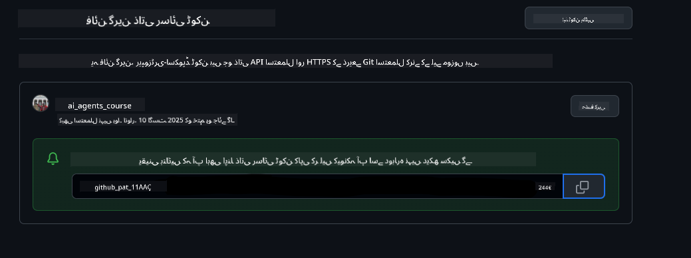
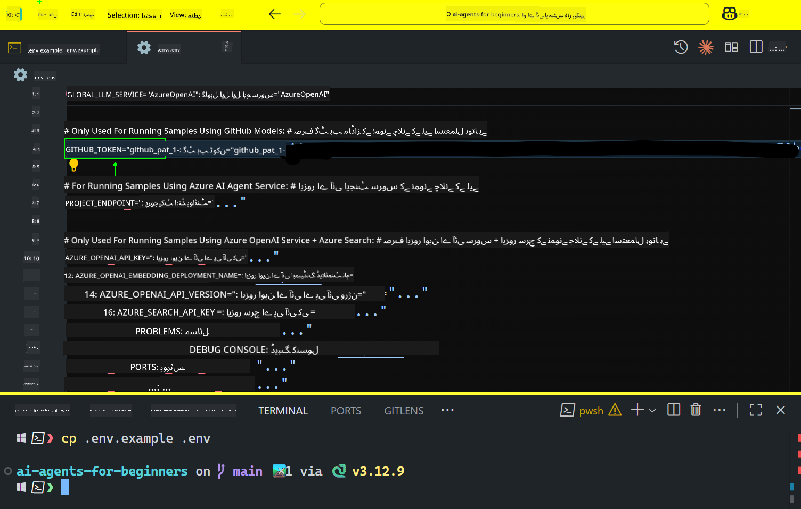

<!--
CO_OP_TRANSLATOR_METADATA:
{
  "original_hash": "c55b973b1562abf5aadf6a4028265ac5",
  "translation_date": "2025-08-29T09:31:05+00:00",
  "source_file": "00-course-setup/README.md",
  "language_code": "ur"
}
-->
# کورس سیٹ اپ

## تعارف

اس سبق میں ہم اس کورس کے کوڈ سیمپلز کو چلانے کے طریقے پر بات کریں گے۔

## دیگر سیکھنے والوں کے ساتھ شامل ہوں اور مدد حاصل کریں

اپنے ریپو کو کلون کرنے سے پہلے، [AI Agents For Beginners Discord چینل](https://aka.ms/ai-agents/discord) میں شامل ہوں تاکہ سیٹ اپ میں مدد حاصل کریں، کورس کے بارے میں سوالات پوچھیں، یا دیگر سیکھنے والوں کے ساتھ جڑیں۔

## اس ریپو کو کلون یا فورک کریں

شروع کرنے کے لیے، براہ کرم GitHub ریپوزٹری کو کلون یا فورک کریں۔ اس سے آپ کے پاس کورس کے مواد کا اپنا ورژن ہوگا تاکہ آپ کوڈ کو چلا سکیں، ٹیسٹ کر سکیں، اور اس میں تبدیلیاں کر سکیں!

یہ لنک پر کلک کرکے کیا جا سکتا ہے:


## کوڈ چلانا

یہ کورس جیوپیٹر نوٹ بکس کی ایک سیریز پیش کرتا ہے جنہیں آپ AI ایجنٹس بنانے کا عملی تجربہ حاصل کرنے کے لیے چلا سکتے ہیں۔

کوڈ سیمپلز درج ذیل استعمال کرتے ہیں:

**GitHub اکاؤنٹ درکار ہے - مفت**:

1) Semantic Kernel Agent Framework + GitHub Models Marketplace۔ لیبل: (semantic-kernel.ipynb)  
2) AutoGen Framework + GitHub Models Marketplace۔ لیبل: (autogen.ipynb)

**Azure سبسکرپشن درکار ہے**:  
3) Azure AI Foundry + Azure AI Agent Service۔ لیبل: (azureaiagent.ipynb)

ہم آپ کو تینوں قسم کے مثالوں کو آزمانے کی ترغیب دیتے ہیں تاکہ آپ دیکھ سکیں کہ آپ کے لیے کون سا بہترین کام کرتا ہے۔

آپ جو بھی آپشن منتخب کریں، وہ نیچے دیے گئے سیٹ اپ کے مراحل کا تعین کرے گا:

## ضروریات

- Python 3.12+  
  - **نوٹ**: اگر آپ کے پاس Python 3.12 انسٹال نہیں ہے، تو اسے انسٹال کریں۔ پھر python3.12 کا استعمال کرتے ہوئے اپنا venv بنائیں تاکہ requirements.txt فائل سے درست ورژنز انسٹال ہوں۔
- GitHub اکاؤنٹ - GitHub Models Marketplace تک رسائی کے لیے
- Azure سبسکرپشن - Azure AI Foundry تک رسائی کے لیے
- Azure AI Foundry اکاؤنٹ - Azure AI Agent Service تک رسائی کے لیے

ہم نے اس ریپوزٹری کی روٹ میں ایک `requirements.txt` فائل شامل کی ہے جس میں کوڈ سیمپلز کو چلانے کے لیے تمام ضروری Python پیکجز شامل ہیں۔

آپ انہیں درج ذیل کمانڈ کو اپنی ٹرمینل میں ریپوزٹری کی روٹ پر چلا کر انسٹال کر سکتے ہیں:

```bash
pip install -r requirements.txt
```

ہم کسی بھی تنازعے اور مسائل سے بچنے کے لیے Python ورچوئل انوائرمنٹ بنانے کی تجویز دیتے ہیں۔

## VSCode سیٹ اپ کریں

یقینی بنائیں کہ آپ VSCode میں Python کا درست ورژن استعمال کر رہے ہیں۔


## GitHub ماڈلز کے ساتھ سیمپلز کے لیے سیٹ اپ کریں

### مرحلہ 1: اپنا GitHub پرسنل ایکسیس ٹوکن (PAT) حاصل کریں

یہ کورس GitHub Models Marketplace کا استعمال کرتا ہے، جو آپ کو بڑے لینگویج ماڈلز (LLMs) تک مفت رسائی فراہم کرتا ہے جنہیں آپ AI ایجنٹس بنانے کے لیے استعمال کریں گے۔

GitHub ماڈلز استعمال کرنے کے لیے، آپ کو ایک [GitHub Personal Access Token](https://docs.github.com/en/authentication/keeping-your-account-and-data-secure/managing-your-personal-access-tokens) بنانا ہوگا۔

یہ آپ کے GitHub اکاؤنٹ میں جا کر کیا جا سکتا ہے۔

براہ کرم [Principle of Least Privilege](https://docs.github.com/en/get-started/learning-to-code/storing-your-secrets-safely) پر عمل کریں جب آپ اپنا ٹوکن بنائیں۔ اس کا مطلب ہے کہ آپ کو صرف وہی اجازتیں دینی چاہئیں جو اس کورس کے کوڈ سیمپلز کو چلانے کے لیے ضروری ہیں۔

1. **Developer settings** میں جا کر بائیں جانب `Fine-grained tokens` آپشن منتخب کریں۔  
   

   پھر `Generate new token` منتخب کریں۔

   

2. اپنے ٹوکن کے لیے ایک وضاحتی نام درج کریں جو اس کے مقصد کی عکاسی کرے، تاکہ بعد میں اسے پہچاننا آسان ہو۔

    🔐 **ٹوکن کی مدت کی تجویز**  
    تجویز کردہ مدت: 30 دن  
    زیادہ محفوظ طریقے کے لیے، آپ مختصر مدت کا انتخاب کر سکتے ہیں—جیسے 7 دن 🛡️  
    یہ ایک ذاتی ہدف مقرر کرنے اور کورس مکمل کرنے کا ایک بہترین طریقہ ہے جب آپ کی سیکھنے کی رفتار تیز ہو 🚀۔

    

3. ٹوکن کے دائرہ کار کو اس ریپوزٹری کے فورک تک محدود کریں۔

    

4. ٹوکن کی اجازتوں کو محدود کریں: **Permissions** کے تحت، **Account** ٹیب پر کلک کریں، اور "+ Add permissions" بٹن پر کلک کریں۔ ایک ڈراپ ڈاؤن ظاہر ہوگا۔ براہ کرم **Models** تلاش کریں اور اس کے لیے باکس کو چیک کریں۔  
    

5. ٹوکن بنانے سے پہلے مطلوبہ اجازتوں کی تصدیق کریں۔  
   

6. ٹوکن بنانے سے پہلے، یقینی بنائیں کہ آپ اسے کسی محفوظ جگہ جیسے پاس ورڈ مینیجر والٹ میں محفوظ کرنے کے لیے تیار ہیں، کیونکہ یہ بنانے کے بعد دوبارہ نہیں دکھایا جائے گا۔  
   

ابھی آپ نے جو نیا ٹوکن بنایا ہے اسے کاپی کریں۔ آپ اسے اس کورس میں شامل `.env` فائل میں شامل کریں گے۔

### مرحلہ 2: اپنی `.env` فائل بنائیں

اپنی `.env` فائل بنانے کے لیے اپنی ٹرمینل میں درج ذیل کمانڈ چلائیں:

```bash
cp .env.example .env
```

یہ مثال فائل کو کاپی کرے گا اور آپ کی ڈائریکٹری میں ایک `.env` بنائے گا جہاں آپ ماحول کے متغیرات کے لیے قدریں بھریں گے۔

اپنا ٹوکن کاپی کرنے کے بعد، اپنی پسندیدہ ٹیکسٹ ایڈیٹر میں `.env` فائل کھولیں اور اپنے ٹوکن کو `GITHUB_TOKEN` فیلڈ میں پیسٹ کریں۔  


اب آپ اس کورس کے کوڈ سیمپلز کو چلانے کے قابل ہونے چاہئیں۔

## Azure AI Foundry اور Azure AI Agent Service کے ساتھ سیمپلز کے لیے سیٹ اپ کریں

### مرحلہ 1: اپنا Azure پروجیکٹ اینڈ پوائنٹ حاصل کریں

Azure AI Foundry میں ہب اور پروجیکٹ بنانے کے مراحل پر عمل کریں: [Hub resources overview](https://learn.microsoft.com/en-us/azure/ai-foundry/concepts/ai-resources)

ایک بار جب آپ نے اپنا پروجیکٹ بنا لیا، تو آپ کو اپنے پروجیکٹ کے لیے کنکشن اسٹرنگ حاصل کرنے کی ضرورت ہوگی۔

یہ Azure AI Foundry پورٹل میں اپنے پروجیکٹ کے **Overview** صفحے پر جا کر کیا جا سکتا ہے۔


### مرحلہ 2: اپنی `.env` فائل بنائیں

اپنی `.env` فائل بنانے کے لیے اپنی ٹرمینل میں درج ذیل کمانڈ چلائیں:

```bash
cp .env.example .env
```

یہ مثال فائل کو کاپی کرے گا اور آپ کی ڈائریکٹری میں ایک `.env` بنائے گا جہاں آپ ماحول کے متغیرات کے لیے قدریں بھریں گے۔

اپنا ٹوکن کاپی کرنے کے بعد، اپنی پسندیدہ ٹیکسٹ ایڈیٹر میں `.env` فائل کھولیں اور اپنے ٹوکن کو `PROJECT_ENDPOINT` فیلڈ میں پیسٹ کریں۔

### مرحلہ 3: Azure میں سائن ان کریں

سیکیورٹی کے بہترین عمل کے طور پر، ہم [keyless authentication](https://learn.microsoft.com/azure/developer/ai/keyless-connections?tabs=csharp%2Cazure-cli?WT.mc_id=academic-105485-koreyst) کا استعمال کریں گے تاکہ Microsoft Entra ID کے ساتھ Azure OpenAI میں تصدیق کی جا سکے۔

اگلا، ایک ٹرمینل کھولیں اور `az login --use-device-code` کمانڈ چلا کر اپنے Azure اکاؤنٹ میں سائن ان کریں۔

ایک بار جب آپ لاگ ان ہو جائیں، تو ٹرمینل میں اپنی سبسکرپشن منتخب کریں۔

## اضافی ماحول کے متغیرات - Azure Search اور Azure OpenAI

ایجنٹک RAG سبق - سبق 5 - کے لیے ایسے سیمپلز ہیں جو Azure Search اور Azure OpenAI کا استعمال کرتے ہیں۔

اگر آپ ان سیمپلز کو چلانا چاہتے ہیں، تو آپ کو اپنی `.env` فائل میں درج ذیل ماحول کے متغیرات شامل کرنے ہوں گے:

### Overview صفحہ (پروجیکٹ)

- `AZURE_SUBSCRIPTION_ID` - اپنے پروجیکٹ کے **Overview** صفحے پر **Project details** چیک کریں۔

- `AZURE_AI_PROJECT_NAME` - اپنے پروجیکٹ کے **Overview** صفحے کے اوپر دیکھیں۔

- `AZURE_OPENAI_SERVICE` - **Overview** صفحے پر **Azure OpenAI Service** کے لیے **Included capabilities** ٹیب میں دیکھیں۔

### مینجمنٹ سینٹر

- `AZURE_OPENAI_RESOURCE_GROUP` - **Management Center** کے **Overview** صفحے پر **Project properties** پر جائیں۔

- `GLOBAL_LLM_SERVICE` - **Connected resources** کے تحت، **Azure AI Services** کنکشن کا نام تلاش کریں۔ اگر درج نہ ہو، تو اپنے ریسورس گروپ کے تحت Azure پورٹل میں AI Services ریسورس کا نام چیک کریں۔

### ماڈلز + اینڈ پوائنٹس صفحہ

- `AZURE_OPENAI_EMBEDDING_DEPLOYMENT_NAME` - اپنے ایمبیڈنگ ماڈل (مثلاً `text-embedding-ada-002`) کو منتخب کریں اور ماڈل کی تفصیلات سے **Deployment name** نوٹ کریں۔

- `AZURE_OPENAI_CHAT_DEPLOYMENT_NAME` - اپنے چیٹ ماڈل (مثلاً `gpt-4o-mini`) کو منتخب کریں اور ماڈل کی تفصیلات سے **Deployment name** نوٹ کریں۔

### Azure پورٹل

- `AZURE_OPENAI_ENDPOINT` - **Azure AI services** تلاش کریں، اس پر کلک کریں، پھر **Resource Management**، **Keys and Endpoint** پر جائیں، نیچے "Azure OpenAI endpoints" تک اسکرول کریں، اور وہ کاپی کریں جو "Language APIs" کہتا ہے۔

- `AZURE_OPENAI_API_KEY` - اسی اسکرین سے، KEY 1 یا KEY 2 کاپی کریں۔

- `AZURE_SEARCH_SERVICE_ENDPOINT` - اپنے **Azure AI Search** ریسورس کو تلاش کریں، اس پر کلک کریں، اور **Overview** دیکھیں۔

- `AZURE_SEARCH_API_KEY` - پھر **Settings** اور پھر **Keys** پر جائیں تاکہ پرائمری یا سیکنڈری ایڈمن کی کو کاپی کریں۔

### بیرونی ویب صفحہ

- `AZURE_OPENAI_API_VERSION` - [API version lifecycle](https://learn.microsoft.com/en-us/azure/ai-services/openai/api-version-deprecation#latest-ga-api-release) صفحے پر **Latest GA API release** کے تحت دیکھیں۔

### Keyless Authentication سیٹ اپ کریں

اپنی اسناد کو ہارڈ کوڈ کرنے کے بجائے، ہم Azure OpenAI کے ساتھ ایک keyless کنکشن استعمال کریں گے۔ ایسا کرنے کے لیے، ہم `DefaultAzureCredential` کو امپورٹ کریں گے اور بعد میں `DefaultAzureCredential` فنکشن کو اسناد حاصل کرنے کے لیے کال کریں گے۔

```python
from azure.identity import DefaultAzureCredential, InteractiveBrowserCredential
```

## کہیں پھنس گئے؟

اگر آپ کو اس سیٹ اپ کو چلانے میں کوئی مسئلہ ہو، تو ہمارے

---

**ڈسکلیمر**:  
یہ دستاویز AI ترجمہ سروس [Co-op Translator](https://github.com/Azure/co-op-translator) کا استعمال کرتے ہوئے ترجمہ کی گئی ہے۔ ہم درستگی کے لیے کوشش کرتے ہیں، لیکن براہ کرم آگاہ رہیں کہ خودکار ترجمے میں غلطیاں یا عدم درستگی ہو سکتی ہیں۔ اصل دستاویز کو اس کی اصل زبان میں مستند ذریعہ سمجھا جانا چاہیے۔ اہم معلومات کے لیے، پیشہ ور انسانی ترجمہ کی سفارش کی جاتی ہے۔ اس ترجمے کے استعمال سے پیدا ہونے والی کسی بھی غلط فہمی یا غلط تشریح کے لیے ہم ذمہ دار نہیں ہیں۔